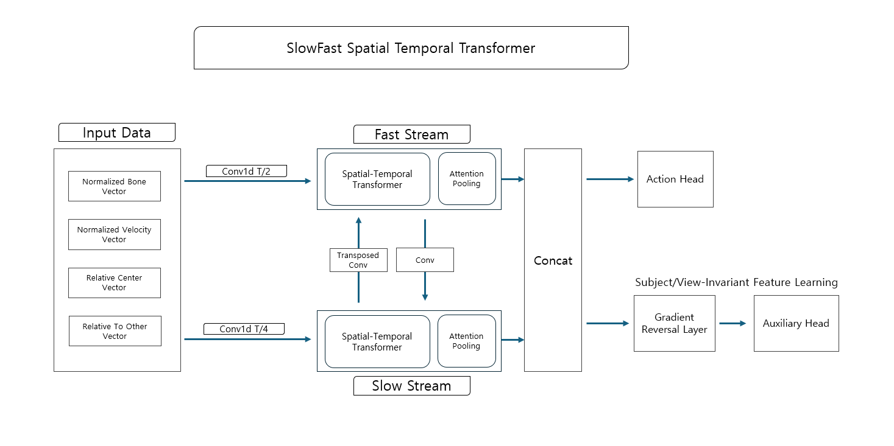
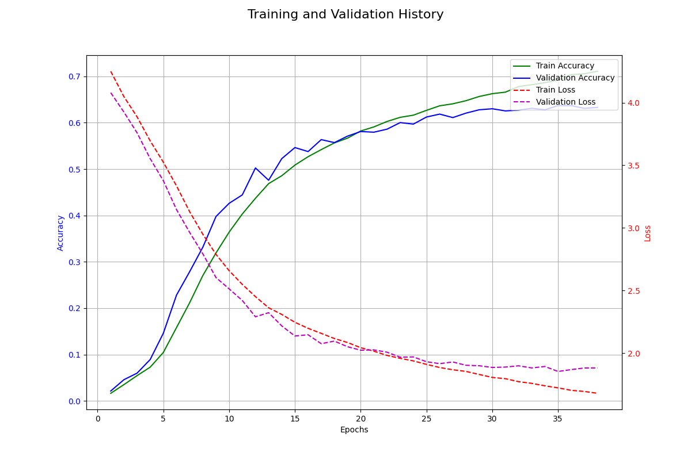

# SlowFast Spatial-Temporal Transformer 보고서

# 0. 요약:  성능 향상을 위한 Two Stream Spatial-Temporal Transformer 연구

## 0-1. 연구 목적

<aside>

행동 사전 지식을 활용해 모델의 학습 효율성을 높이고 Two Stream의 SlowFast 구조를 사용하여 정확도와 효율성의 균형을 달성하고자 한다.

</aside>

## 0-2. 제안 방법론

<aside>

Two Stream에서 처리하는 방식에 차이를 둔다. 그리고 이 두 Stream 사이에 Connection을 두어 상호 정보 교환을 통해 시공간 특징을 융합한다.

1. Fast Stream: 높은 시간 해상도와 낮은 채널 수를 가진 Stream이다. 급격한 움직임을 포착한다.
2. Slow Stream:  낮은 시간 해상도와 높은 채널 수를 가진 Stream이다. 전체적이고 의미적인 정보를 학습한다.
3. GRL: Gradient Reversal Layer를 통해 피험자 및 시점 변화에 강건한 도메인 불변 특징을 학습한다.
4. Input Feature: 12차원 벡터(Bone, Velocity, Relative Center, Relative to Other)를 사용하여 모델이 얕은 구조에서도 행동 패턴을 쉽게 학습하도록 유도한다.
</aside>

## 0-3. 핵심 결과

<aside>

NTU RGB+D 데이터셋에서 다른 모델 대비 낮은 성능을 달성했고 큰 연산량 절감 효과도 보지 못했다.

</aside>

| 모델 이름 | 정확도 (Xview) $\mathbb{E}_1$ | 정확도 (Xsub) $\mathbb{E}_1$ | 파라미터 수 | 연산량 |
| --- | --- | --- | --- | --- |
| Ours | 91.19% | 85.54% | 1.89M | 3.28G |
| Skateformer | 97% | 92.6% | 2.03M | 3.62G |
| HD-GCN | 95.7% | 90.6% | 1.66M | 3.44G |
| FR-Head(GCN) | 95.3% | 90.3% | 1.45M | 3.60G |

## 0-4. 실험 분석 및 한계

<aside>

Transformer 모델인 SkateFormer에 비해 연산량과 파라미터 수가 낮지만 정확도가 5.81%, 7.16%p 낮다. 그리고 GCN 기반 모델들에 비해 파라미터 수는 많고 연산량은 적지만 정확도가 약 4.6%p, 5%p 낮다.

이 모델은 Two Stream을 통해 모델이 보는 시간축을 다르게 해서 행동 인식 정확도를 향상시키고자 했으나 높은 정확도를 달성하지 못했다.

</aside>

# 1. Abstract

<aside>

이 연구는 Skeleton-based Action Recognition의 정확도와 연산 효율성을 확보하기 위해 SlowFast Spatial-Temporal Transformer 모듈을 제안한다. 이 모델은 원시 좌표 대신 척추 길이로 정규화된 12채널의 물리학적 특징 벡터인 Bone, Velocity, Relative Center, Relative To Other Vector를 입력으로 사용한다. 이를 통해 신체 구조의 위상 정보와 움직임 정보를 명시적으로 학습한다.

제안하는 네트워크는 시간적 해상도와 채널 용량을 비대칭적으로 설계한 두 개의 스트림으로 구성된다. Fast Stream은 높은 시간 해상도(T/2)와 낮은 채널 차원을 유지하여 급격한 움직임을 포착하며, Slow Stream은 낮은 시간 해상도(T/4)와 깊은 채널 차원을 통해 거시적인 행동의 의미를 학습한다. 두 스트림은 측면 연결을 통해 상호 정보를 교환하며 시공간적 특징을 통합한다. 또한, 피험자 및 시점의 변화에 강건한 특징을 학습하기 위해 Gradient Reversal Layer (GRL)를 적용하여 도메인 불변성을 강화하였다.

NTU RGB+D 60 데이터셋을 이용한 실험 결과, 제안 모델은 X-View 91.19%, X-Sub 85.54%의 정확도를 달성하였다. 특히 3.28 GFLOPs의 낮은 연산량과 200 FPS의 빠른 처리 속도를 기록하여, 경량화된 구조로도 높은 성능과 실시간성을 확보할 수 있음을 입증하였다.

</aside>

---

# 2. 아이디어 및 모델 구조

## 2-1. Input Data without Coords

### 2-1-a. Input 데이터를 미리 변형해야 하는 이유

<aside>

척추 길이를 이용한 정규화를 했다. 카메라와 피사체의 거리나 사람의 키에 상관 없이 동일한 동작은 동일한 크기의 벡터를 갖도록 만든다.

Transformer는 모든 토큰을 동등하게 취급하기 때문에 입력데이터들 사이의 관계를 학습하는 데 더 많은 층이 필요하다. 따라서 물리학적 사전지식을 포함하는 12차원의 입력 데이터를 만들어 모델에 주면 얕은 구조로도 고차원적인 행동 분류에 집중할 수 있게 된다.

아래에서 설명할 Bone Vector와 Velocity Vector는 데이터가 존재하는 공간의 위상을 명확하게 한다. 절대 좌표가 아닌 신체 중심을 기준으로 하는 상대 좌표에 대한 Bone Vector는 위치 불변성을 강화하며, Velocity Vector는 움직임 정보를 제공한다. 이를 통해 데이터의 형태들이 클래스별로 구분되기 쉬운 형태로 정렬되어 입력되고, 따라서 비선형 변환을 많이 수행하지 않아도 결정 경계를 쉽게 그릴 수 있다.

</aside>

### 2-1-b. 4가지 Input data 변형

<aside>

따라서 x, y, z 좌표 데이터를 12개의 채널을 가진 특징으로 변환한다.

Normalized Bone Vector는 부모 관절에서 자식 관절로 향하는 방향과 길이를 의미한다. 이 특징은 3차원이다. 예를 들어, 어깨에서 팔꿈치로 뻗은 팔의 각도와 방향을 나타낸다.

Normalized Velocity Vector는 현재 프레임과 이전 프레임의 좌표 차이를 계산한다. 이 특징은 3차원이다. 정지한 동작은 0이고 빠르게 움직이는 관절은 큰 값이다. 자세는 비슷하지만 속도가 다른 행동을 구분하게 한다.

Relative Center Vector는 두 사람 사이의 Global Interaction을 나타낸다. 즉, 사람1의 몸 중심과 사람2의 몸 중심 사이의 거리 벡터다. 3차원이다. 포옹이나 악수처럼 거리가 다른 행동에서 중요하다.

Relative To Other Vector는 정밀한 상호작용 디테일을 의미한다. 사람1의 모든 관절이 사람2의 몸 중심으로부터 어디에 있는지를 계산한다.

최종적으로 (Batch, Time, Joints, Dimension) 모양이 출력된다.

</aside>

## 2-2. SlowFast

<aside>

시간축을 Conv1d를 통해서 프레임을 T/2과 T/4로 압축한 뒤, T/2는 Fast에 넣고 T/4는 Slow에 넣는다. Slow와 Fast로 나눈 이유는 짧은 간격과 넓은 간격의 프레임을 다르게 처리해서 미세한 행동과 거친 행동을 다른 스트림으로 처리해서 파악하도록 하기 위함이다.

2 프레임을 적은 은닉 차원 수로, 4프레임을 많은 은닉 차원 수로 통과하게 한 이유는 정보의 연산량 때문이다. 2프레임씩 보는 경로는 연산량이 많아서 은닉 차원 수를 높이면 연산량이 빠르게 증가한다. 하지만 4프레임씩 보는 경로는 연산량이 적어서 은닉 차원 수를 높여도 연산량이 빠르게 증가하지 않는다.

Slow 스트림의 Transformer가 층을 깊게 쌓을 수록 차원을 확장하도록 설계한 이유는 기존의 딥러닝 모델들이 깊은 층으로 갈 수록 채널 수를 늘려서 추상적이고 복잡한 의미를 담기 때문이다.

</aside>

## 2-3. Spatial Temporal Transformer

<aside>

Attnetion 연산을 수행하기 전에 데이터를 목표하는 차원으로 미리 변환한다. 차원이 다른 상태의 잔차연결은 Linear 레이어를 통해 목표하는 차원 크기로 변해준 뒤 잔차연결을 수행한다.

입력 데이터를 초기 임베딩을 통해 64차원으로 만든다. 그리고 첫 번째 Slow ST Transformer 블록 내부에서 Linear Layer를 통해 128차원으로 확장된다. 그리고 여기서 Positional Encoding이 더해지고 Attention을 수행한다. 그리고 64차원의 입력이 Linear Layer를 통해 128차원으로 변환되고 잔차연결이 된다. 그 다음에 128차원을 출력한다.

두 번째 Slow ST Transformer 블록 내부에서 Linear Layer를 통해 128차원이 256차원으로 확장되고 Attention을 수행한다. 그리고 128차원의 입력이 Linear Layer를 통해 256차원으로 변환되고 잔차연결이 된다. 그 다음에 256차원을 출력한다.

Fast와 Slow가 서로 정보 공유를 할 때 출력하는 시간 차원과 채널 차원 수가 달라서 형태를 맞춰줘야 한다. Fast에서 Slow로 정보를 공유할 때는 Conv2d를 사용해서 시간 차원을 절반으로 줄이고 채널을 늘린다. Slow에서 Fast로 정보를 공유할 때는 ConvTranspose2d를 사용해서 시간 차원을 2배로 늘리고 채널을 줄인다.

구체적으로, Fast 스트림의 입력은 (N, 64, T, V)이고, Slow 스트림의 입력은 (N, 64, T/2 V)이다. 첫 번째 Transformer 블록에 진입하기 전에 정보 공유가 한 번 진행된다. 두 번째 Transformer 블록에 입력되는 모양은 Fast 스트림의 경우 (N, 64, T, V)이고 Slow 스트림의 경우 (N, 128, T/2 V)이다. 두 번째 Transformer 블록에 진입하기 전에 정보 공유가 한 번 더 진행된다.

모델은 공통 특징 추출기와 2개의 Head로 나뉘게 된다.

</aside>

## 2-4. GRL(Gradient Reversal Layer)

<aside>

2개의 Head로 나뉘게 되는데, 하나의 head는 Action Classifier이고 다른 하나의 Head는 Domain Classifier이다. GRL는 순전파에서 두 헤드 모두 아무런 동작을 하지 않는다. 하지만 역전파 시에 Domain Classifier만의 그레이디언트 부호를 반대로 뒤집는다. 

</aside>

## 2-5. Attentive Pooling

<aside>

Attentive Pooling은 중요한 정보에 가중치를 두고 합산하는 방식이다.

$e_i = \mathbf{w}^\top x_i + b$

위 수식을 통해  각 시공간 토큰 x가 최종 분류에 얼마나 기여하는지 판단하는 점수e를 계산한다.

$\alpha_i = \text{Softmax}(e_i) = \frac{\exp(e_i)}{\sum_{k=1}^{L} \exp(e_k)}$

Softmax를 사용해서 점수의 분포를 0 ~ 1 사이로 변환한다. 그러면 가중치 $a_i$가 나오게 된다.

$v = \sum_{i=1}^{L} \alpha_i x_i$

이제 각 입력 x에 가중치 $a_i$를 곱한 뒤 합산해서 최종 출력 벡터를 만든다.

</aside>

## 2-6. RMSNorm

<aside>

RMSNorm은 평균을 빼는 연산을 생략한다. Transformer 구조에서 평균을 계산하고 빼는 연산은 성능 향상에 기여하지 못하고 연산량만 차지하기 때문이다. 

$\text{RMS}(x) = \sqrt{\frac{1}{d} \sum_{i=1}^{d} x_i^2 + \epsilon}$

이 수식은 입력 벡터를 제곱해서 평균을 낸 뒤 다시 제곱근을 한다. 이를 통해 벡터가 원점으로부터 얼마나 멀리 떨어져 있는지 측정한다.

그리고 입력 벡터를 RMS 값으로 나누어 정규화를 수행한다.

$\bar{x}_i = \frac{x_i}{\text{RMS}(x)}$

그리고 정규화된 값에 학습 가능한 파라미터를 곱해서 최종 출력을 낸다. 이를 통해 정규화로 인해 사라진 특징 사이의 중요도 차이를 다시 강조한다.

$y_i = \bar{x}_i \cdot g_i$

</aside>

---

# 3. 실험 결과

<aside>

실험에서 사용한 데이터셋은 NTU RGB+D 60 데이터셋을 사용했다. NTU RGB+D 120 데이터셋을 사용하지 않은 이유는 현재 소유한 GPU에서는 120개의 클래스를 구분할 수 있는 모델을 구축하기 어렵다고 판단했기 때문이다.

40 epoch로 학습을 마무리했으며 이 중 초반의 7 epoch는 Warmup 기법을 사용해 학습률을 천천히 증가시켰다. 학습 스케줄러는 Cosine Decay를 사용했다. 이를 통해 40 Epoch까지 학습률을 천천히 낮추면서 학습을 진행했다.

GRL의 Alpha 값도 Warmup 기간인 7 Epoch까지는 0으로 설정해 비활성화를 했고, 그 뒤부터 점진적으로 설정된 alpha 값까지 증가시켰다. 왜냐하면 학습 초기 특징 추출기의 불안정성을 방지하기 위함이다.

하이퍼 파라미터 튜닝은 Optuna를 통해 수행했으며, Optuna를 사용해 30 Trial까지 수행했다.

Optimizer는 AdamW를 사용했고 이 때의 weight Decay는 0.0023을 사용했다. Learning Rate는 0.00456이다. dropout은 0.45, GRL Alpha는 0.2, 증강 확률은 80%, Lable Smoothing은 0.114이다. 배치 사이즈는 128로 설정했다.

</aside>

<aside>

이 모델의 연산량은 다음과 같다. 파라미터 수는 1.89M이고, FLOPs는 3.28G이고, FPS: 200 frames/sec이다.

다른 모델과 비교했을 때, 아래 표와 같다.

</aside>

| 모델 이름 | 정확도 (Xview) $\mathbb{E}_1$ | 정확도 (Xsub) $\mathbb{E}_1$ | 파라미터 수 | 연산량 |
| --- | --- | --- | --- | --- |
| Ours | 91.19% | 85.54% | 1.89M | 3.28G |
| Skateformer | 97% | 92.6% | 2.03M | 3.62G |
| HD-GCN | 95.7% | 90.6% | 1.66M | 3.44G |
| FR-Head(GCN) | 95.3% | 90.3% | 1.45M | 3.60G |

<aside>

Xview: 0.9119

</aside>

<aside>

Xsub: 0.8554

</aside>

---

# 4. 결론

<aside>

이 연구에서는 SlowFast Spatial-Temporal Transformer를 제안하여 Skeleton-based Action Recognition에서의 효율적인 연산 구조를 탐구하였다. 

기존의 원시 좌표를 그대로 사용하는 대신, 척추 길이를 기준으로 정규화된 12채널의 물리학적 특징 벡터(Bone, Velocity, Relative Center, Relative To Other Vector)를 입력으로 사용함으로써 얕은 모델에서 모델의 학습 효율을 극대화하였다.

제안된 네트워크는 시간적 해상도와 채널 용량을 비대칭적으로 설계한 Fast Stream과 Slow Stream으로 구성되었다. 시간 해상도가 높은 경로는 채널 용량을 낮게 잡아서 연산량 증가를 억제하고, 시간 해상도가 낮은 경로는 채널 용량을 높게 잡았다.

실험 결과, 제안 모델은 물리적 사전 지식을 반영한 입력 데이터 정규화와 이원화된 스트림 구조를 통해 학습 수렴 속도를 높이고 실시간성(200 FPS)을 확보하는 데 성공하였다. 그러나 기존 SOTA 모델과의 비교 분석을 통해 다음과 같은 명확한 한계점과 연구 과제를 도출하였다.

제안 모델은 SkateFormer 대비 파라미터 수를 약 7%(2.03M → 1.89M), 연산량을 약 9%(3.62G → 3.28G) 낮았다. 그러나 정확도(X-View 기준)는 97%에서 91.19%로 약 5.81%p 낮았다. 이는 정확도 손실에 비해 연산량과 파라미터가 크게 낮아지지 않음을 보여준다.

이 모델은 Two Stream을 통해 모델이 보는 시간축을 다르게 해서 행동 인식 정확도를 향상시키고자 했으나 높은 정확도를 달성하지 못했다.

</aside>

# 참고한 논문

SlowFast Networks for Video Recognition

Unsupervised Domain Adaptation by Backpropagation

Skeleton-based Action Recognition Via Spatial and Temporal Transformer Networks

SkateFormer: Skeletal-Temporal Transformer for Human Action Recognition
