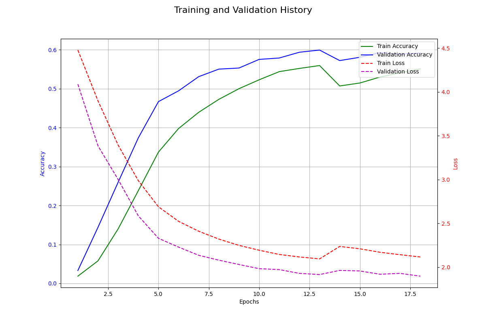
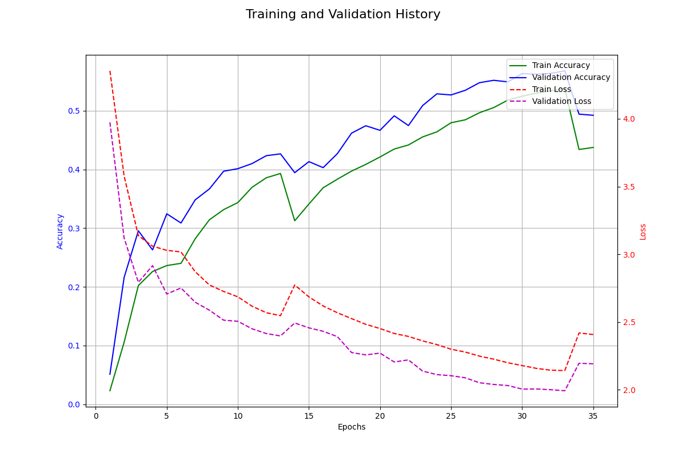
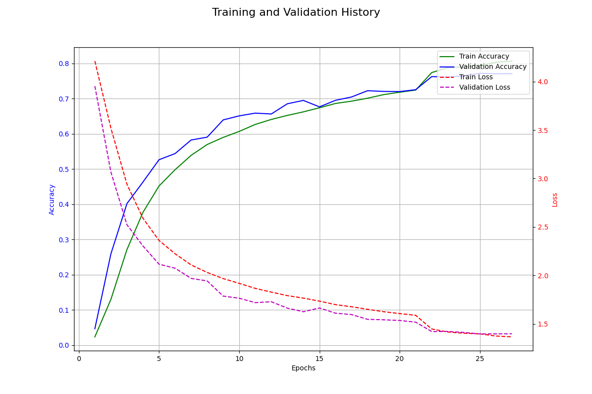
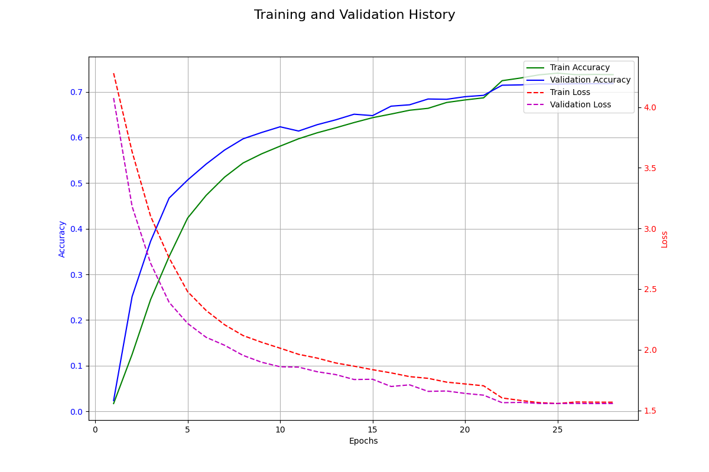
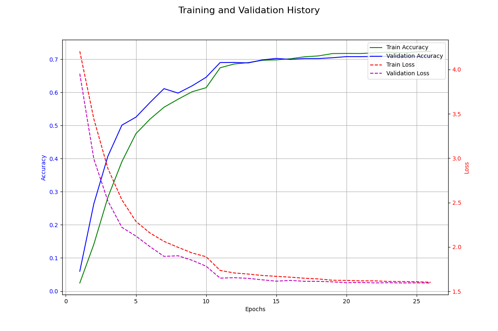
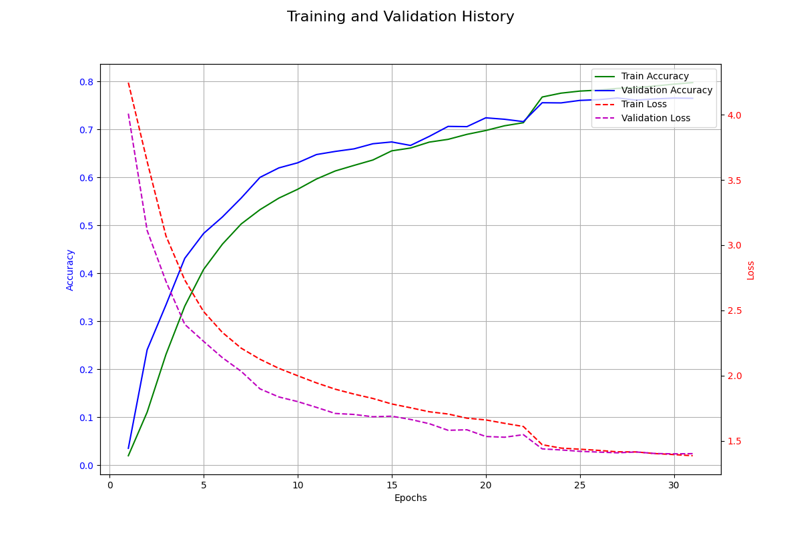
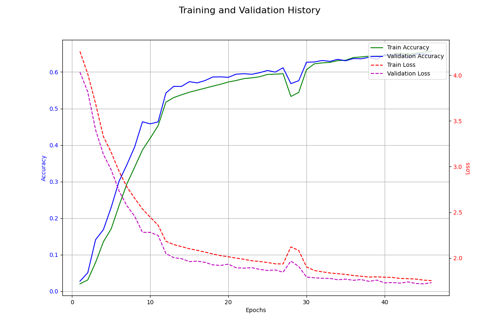
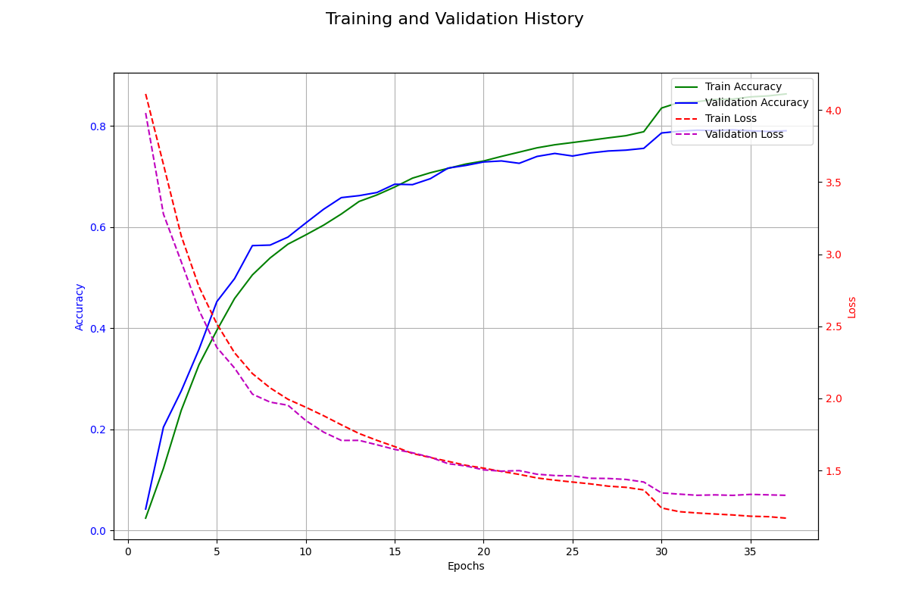
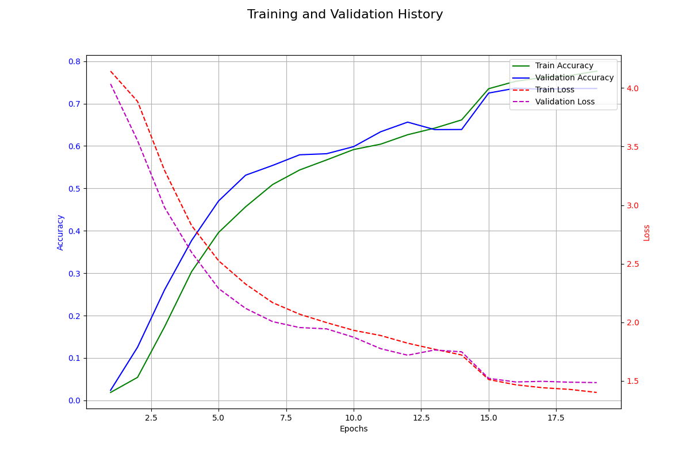
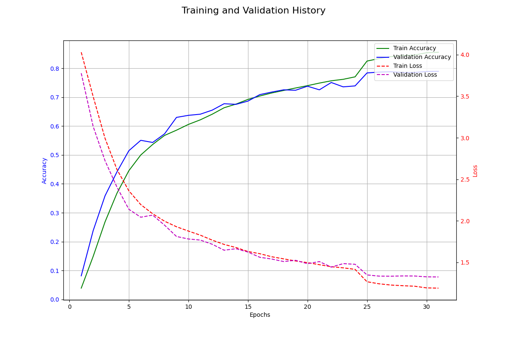

# 데이터셋에 대한 이해

## NTU RGB+D 60과 120의 차이

NTU RGB+D skeleton 60과 120은 3D 센서로 촬영한 인간 행동 인식 연구 데이터셋입니다.

NTU RGB+D 60과 120의 차이는 행동 클래스 수, 영상 샘플 수, 촬영 대상자 수, 촬영 환경에서 차이가 있습니다.

60은 행동 클래스 수가 60개이고, 영상 샘플 수는 56000개이고, 촬영 대상자 수는 40명이고, 촬영 환경은 실내 실험실 환경입니다.

120은 행동 클래스 수가 120개이고, 영상 샘플 수는 114,000개 이상이고, 촬영 대상자 수는 106명이고, 촬영 환경은 실내 실험실 환경에 새로운 대규모 환경을 추가한 것입니다.

## NTU RGB+D 60의 데이터 분석

NTU RGB+D 60의 데이터 중 하나인 S001C001P001R001A001.skeleton을 보면, S001은 Setup 번호인데 촬영 환경 및 카메라 배치를 의미합니다. C001은 카메라 ID를 의미하고, P001은 사람 ID 입니다. R001은 Replication 번호인데 동일한 사람이 동일한 행동을 반복한 횟수입니다. A001은 행동의 종류를 나타냅니다.

파일 안에 첫 번째 줄에 있는 숫자는 프레임 수로, 행동 샘플이 해당 프레임 수로 구성되어 있다는 것을 나타냅니다.

그리고 그 다음은 신체 수로, 해당 프레임에서 감지된 사람의 신체 수를 나타냅니다.

그 다음 줄의 긴 숫자는 감지된 신체의 고유 ID입니다.

그리고 그 다음 줄의 숫자(25)는 감지되어 추적하고 있는 Joint의 수를 나타냅니다.

이후에 25개의 줄은 각 joint의 상세 x/y/z 좌표와 이미지 상의 2D 좌표, 관절 방향등이 적혀 있습니다.

## 이 데이터셋을 사용할 때 주의해야 할 점

이 데이터셋에는 한 프레임 안에 2명의 skeleton 데이터가 포함될 수 있어서 코드를 작성할 때 2명의 행동을 인식하는 경우를 고려해야 합니다.

한 명만 고려했을 때 정확도는 60%에서 멈추었지만, 2명의 행동 데이터를 고려하게 코드를 작성했더니 정확도가 70%로 상승했습니다.

# 핵심 아이디어

제 아이디어는 위치 좌표를 사용하지 않고 각 joint의 프레임 간 이동 거리, 이동 방향, 가속도만을 사용해서 행동 인식을 하고자 합니다.

## 위치 좌표 대신 이동과 변화량을 사용하는 이유

위치 좌표는 프레임 안에서 매우 큰 값 범위를 가질 수 있고, 소수점 이하의 정밀도가 중요합니다.
하지만 프레임 사이의 이동량과 속도는 일반적으로 작은 범위 값 안에 집중되어 있습니다. 

30프레임 기준으로 1프레임당 1/30초 이므로, 속도나 가속도는 0 근처에 분포할 가능성이 높습니다. 이러한 데이터 분포는 낮은 비트로 양자화하기에 유리합니다.

만약 8비트 양자화를 적용한다고 했을 경우, 520.18723 같은 위치 좌표를 양자화하면 정보 손실이 크지만, 프레임 간 이동량인 0.51283 같은 값은 스케일링을 통해 8비트 범위에서 효율적으로 매핑할 수 있어서 정보 손실을 최소화할 수 있습니다. 이는 모델 경량화와 추론 속도 향상에 중요한 역할을 합니다.

그리고 좌표값 대신 변화량 정보를 사용하면 Translation Invariance를 확보할 수 있습니다.

위치 좌표를 사용하면 사람이 화면 오른쪽에서 손을 흔드는 것과 화면 왼쪽에서 손을 흔드는 것에서 좌표 값이 다릅니다. 이 때 모델은 위치에 상관 없이 손을 흔드는 패턴을 학습해야 하고, 이는 많은 데이터와 더 큰 모델을 필요로 합니다.

하지만 이동과 방향 정보를 사용하면 사람이 어디에 있던지 손을 흔드는 행동에서 팔꿈치 관절은 손목 관절 대비 상대적인 변화량은 거의 동일합니다.

모델은 불필요한 위치 정보를 배제하고 순수한 움직임 패턴에만 집중할 수 있습니다. 이를 통해 모델을 robust 하게 만들 수 있습니다.

위치 좌표는 Static한 정보이고, 거리와 속도와 가속도는 Dynamic한 정보입니다. 이러한 Dynamic한 정보는 행동을 표현하는 데 직접적인 정보를 제공한다고 생각합니다. 왜냐하면 행동이 곧 동적이기 때문입니다.

입력이 위치 좌표인 경우 여러 프레임 시퀀스를 보고 좌표값들의 변화 추이를 스스로 계산하고 학습해야 합니다. 좌표에 미분을 통해 속도 개념을 스스로 학습하라고 요구하는 것과 같습니다. 하지만 변화량을 입력으로 주면 행동의 본질인 움직임 정보가 이미 계산되어 명시적으로 주는 것이기 때문에 모델이 더 단순하고 직접적으로 움직임 패턴을 학습할 것으로 기대합니다.

이동 거리, 속도, 가속도를 구하기 위해서는 처음에 위치 좌표를 사용해서 전처리를 해야 합니다. 하지만 이 때의 연산량은 딥러닝 모델에 비해 매우 낮은 수준입니다. 따라서 이러한 전처리를 통해 얻을 수 있는 장점이 더 크다고 생각합니다.

# 실험 (1~3)

## 구조

### preprocess_ntu_data.py

preprocess_ntu_data.py에서는 NTU RGB+D 60 Skeleton 데이터셋을 불러와서 전처리를 합니다.

.skeleton 파일을 읽어서 (num_frames, 2, 25 , 3) 형태의 numpy 배열로 변환합니다.

skeleton 중심화를 한 뒤에 변위, 거리, 방향, 가속도를 계산한 뒤 이를 .pt 파일로 저장합니다.

### ntu_data_loader.py

데이터를 불러오고 훈련과 검증 모드를 설정하고 다양한 증강 기법을 적용시키는 파일입니다.

train.py에서 NTURGBDDataset 객체를 생성할 때 명시적으로 train, val을 지정합니다.

임의 회전, 가우시안 노이즈 추가, 임의 스케일링, 관절 마스킹, 시간 마스킹 증강 기법이 사용됐습니다.

증강이 끝난 뒤에 (X - 평균) / 표준편차를 해서 훈련 데이터의 분포를 안정시켜 학습을 준비합니다.

### model.py

모델은 Shif-GCN과 Spatial - Temporal Transformer를 이어서 붙인 아키텍처를 사용했습니다.

우선 첫 프레임 좌표는 pose_vector를 생성하는 데 사용됩니다. 그리고 전체 움직임 정보를 고차원 벡터로 만들고 위치 정보를 추가합니다.

이제 Shift-GCN + ST-Transformer 블록을 통과합니다.

Shift-GCN에서는 미리 정의된 3개의 인접행렬(Root, Close, Far)를 이용해 공간적 특징을 추출합니다.

Shift-GCN을 통과한 텐서는 Spatial Transformer와 Temporal Transformer를 순서대로 통과합니다. 이 각 블록 사이에 잔차 연결이 추가됩니다.

Attention Pooling을 통해 중요한 부분에 높은 가중치를 부여하여 가중합을 계산합니다.

그리고 pose_vector와 이 가중합 벡터를 concatenate 합니다.

마지막으로 dropout과 FC Layer를 통과시켜 최종 확률을 출력합니다.

여기서 Shift-GCN, Spatial Transformer, Temporal Transformer의 바로 뒤와 잔차 연결 블록 내부에서 RMS Normalization이 적용되어 데이터의 스케일을 정규화하고 다음 층으로 안정적인 값을 전달합니다.

## train.py

재현성을 위해 시드를 고정하고, Dataset에 경로, train/val, 프레임 수를 설정하고 이를 DataLoader에 넘겨줘서 효율적인 학습을 준비합니다.

그리고 Shift-GCN + ST-Transformer 블록을 선언하고, 손실 함수를 CrossEntropy로 정의하고, 최적화 함수를 AdamW로 정의합니다.

이전에 만든 체크포인트가 존재한다면 불러옵니다. 그리고 1 epoch 동안 학습/검증을 수행하고 학습 스케줄러를 업데이트 합니다. 이 때 최고 검증 정확도를 달성하면 저장합니다. 그리고 일정 에폭마다 스냅샷을 저장하여 스냅샷 앙상블을 수행합니다.

## 실험 1

아래와 같이 config.py를 설정했습니다.

```
# No nomalize by bone length in preprocess_ntu_data.py
# python train.py --scheduler cosine_decay

# >> 재현성을 위해 시드 설정
SEED = 42

# >> 데이터 로더 설정
MAX_FRAMES = 150  # 시퀀스의 최대 길이 (패딩 또는 절단 기준)
BATCH_SIZE = 32   # 배치 크기
NUM_WORKERS = 6   # 데이터를 불러올 때 사용할 CPU 프로세서 수
PIN_MEMORY = True # GPU 사용 시 데이터 전송 속도를 높이기 위한 설정

# >> 모델 하이퍼파라미터
NUM_JOINTS = 50   # 관절 수
NUM_COORDS = 7    # 거리1 + 방향3 + 가속도3
NUM_CLASSES = 60  # 행동 클래스 수 (NTU RGB+D 60)
PROB = 0.5 # 데이터 증강 확률

# >> 학습 하이퍼파라미터
EPOCHS = 100             # 총 학습 에폭
LEARNING_RATE = 0.0003   # 학습률
DEVICE = 'cuda' if torch.cuda.is_available() else 'cpu' # 학습 장치
WARMUP_EPOCHS = 3        # 학습 초기에 학습률을 서서히 증가시키는 웜업 에폭 수
GRAD_CLIP_NORM = 0.7     # 그레이디언트 폭발을 막기 위한 클리핑 최대 L2 Norm 값
ADAMW_WEIGHT_DECAY = 0.1 # AdamW weight decay , L2 정규화의 강도 설정
PATIENCE = 10 # 조기종료 변수
LABEL_SMOOTHING = 0.1 # Loss Function CrossEntropy의 label smoothing
DROPOUT = 0.5 # dropout


# >> block_type, layer_dims, use_gcn를 설정한다.
# >> block_type='st' : Shift-GCN + ST-Transformer, block_type='standard' : Shift-GCN + Transformer
# >> gcn 사용 여부는 use_gcn을 True, False로 지정한다.
# >> layer_dims 사용법은, [입력 크기, 출력 크기]이다. 만약 4층을 쌓으려면 [64, 128, 128, 256, 256] 하면 된다.
BLOCK_TYPE = 'st'
LAYER_DIMS = [64, 128]
USE_GCN = True

```

24 epoch에서 학습률 0.00027 -> 0.00002

### 결과1



Test Acc: 64.7%

## 실험2

```
# >> 재현성을 위해 시드 설정
SEED = 42

# >> 데이터 로더 설정
MAX_FRAMES = 150  # 시퀀스의 최대 길이 (패딩 또는 절단 기준)
BATCH_SIZE = 32   # 배치 크기
NUM_WORKERS = 6   # 데이터를 불러올 때 사용할 CPU 프로세서 수
PIN_MEMORY = True # GPU 사용 시 데이터 전송 속도를 높이기 위한 설정

# >> 모델 하이퍼파라미터
NUM_JOINTS = 50   # 관절 수
NUM_COORDS = 7    # 거리1 + 방향3 + 가속도3
NUM_CLASSES = 60  # 행동 클래스 수 (NTU RGB+D 60)
PROB = 0.5 # 데이터 증강 확률

# >> 학습 하이퍼파라미터
EPOCHS = 100             # 총 학습 에폭
LEARNING_RATE = 0.0003   # 학습률
DEVICE = 'cuda' if torch.cuda.is_available() else 'cpu' # 학습 장치
WARMUP_EPOCHS = 3        # 학습 초기에 학습률을 서서히 증가시키는 웜업 에폭 수
GRAD_CLIP_NORM = 0.7     # 그레이디언트 폭발을 막기 위한 클리핑 최대 L2 Norm 값
ADAMW_WEIGHT_DECAY = 0.1 # AdamW weight decay , L2 정규화의 강도 설정
PATIENCE = 10 # 조기종료 변수
LABEL_SMOOTHING = 0.1 # Loss Function CrossEntropy의 label smoothing
DROPOUT = 0.5 # dropout


# >> block_type, layer_dims, use_gcn를 설정한다.
# >> block_type='st' : Shift-GCN + ST-Transformer, block_type='standard' : Shift-GCN + Transformer
# >> gcn 사용 여부는 use_gcn을 True, False로 지정한다.
# >> layer_dims 사용법은, [입력 크기, 출력 크기]이다. 만약 4층을 쌓으려면 [64, 128, 128, 256, 256] 하면 된다.
BLOCK_TYPE = 'st'
LAYER_DIMS = [64, 128, 256]
USE_GCN = True
```

### 결과2



75.76%

## 실험3

```
# >> 재현성을 위해 시드 설정
SEED = 42

# >> 데이터 로더 설정
MAX_FRAMES = 150  # 시퀀스의 최대 길이 (패딩 또는 절단 기준)
BATCH_SIZE = 32   # 배치 크기
NUM_WORKERS = 6   # 데이터를 불러올 때 사용할 CPU 프로세서 수
PIN_MEMORY = True # GPU 사용 시 데이터 전송 속도를 높이기 위한 설정

# >> 모델 하이퍼파라미터
NUM_JOINTS = 50   # 관절 수
NUM_COORDS = 7    # 거리1 + 방향3 + 가속도3
NUM_CLASSES = 60  # 행동 클래스 수 (NTU RGB+D 60)
PROB = 0.5 # 데이터 증강 확률

# >> 학습 하이퍼파라미터
EPOCHS = 100             # 총 학습 에폭
LEARNING_RATE = 0.0003   # 학습률 22epoch에서 0.00003으로 수정.
DEVICE = 'cuda' if torch.cuda.is_available() else 'cpu' # 학습 장치
WARMUP_EPOCHS = 3        # 학습 초기에 학습률을 서서히 증가시키는 웜업 에폭 수
GRAD_CLIP_NORM = 0.7     # 그레이디언트 폭발을 막기 위한 클리핑 최대 L2 Norm 값
ADAMW_WEIGHT_DECAY = 0.1 # AdamW weight decay , L2 정규화의 강도 설정
PATIENCE = 10 # 조기종료 변수
LABEL_SMOOTHING = 0.1 # Loss Function CrossEntropy의 label smoothing
DROPOUT = 0.5 # dropout


# >> block_type, layer_dims, use_gcn를 설정한다.
# >> block_type='st' : Shift-GCN + ST-Transformer, block_type='standard' : Shift-GCN + Transformer
# >> gcn 사용 여부는 use_gcn을 True, False로 지정한다.
# >> layer_dims 사용법은, [입력 크기, 출력 크기]이다. 만약 4층을 쌓으려면 [64, 128, 128, 256, 256] 하면 된다.
BLOCK_TYPE = 'st'
LAYER_DIMS = [64, 128, 128, 256]
USE_GCN = True
```

### 결과3



77.16%

## 실험 4

칼만 필터를 사용하여 노이즈를 제거하고, 특정 프레임에서 데이터가 0으로 들어오면 이 값을 무시하고 위치를 보관하고자 합니다.

하지만 칼만 필터를 사용하니까 테스트 정확도가 잘 안오르는 모양이 보입니다.

```
# >> 재현성을 위해 시드 설정
SEED = 42

# >> 데이터 로더 설정
MAX_FRAMES = 150  # 시퀀스의 최대 길이 (패딩 또는 절단 기준)
BATCH_SIZE = 32   # 배치 크기
NUM_WORKERS = 6   # 데이터를 불러올 때 사용할 CPU 프로세서 수 
PIN_MEMORY = True # GPU 사용 시 데이터 전송 속도를 높이기 위한 설정

# >> 모델 하이퍼파라미터
NUM_JOINTS = 50   # 관절 수
NUM_COORDS = 7    # 거리1 + 방향3 + 가속도3
NUM_CLASSES = 60  # 행동 클래스 수 (NTU RGB+D 60)
PROB = 0.5 # 데이터 증강 확률

# >> 학습 하이퍼파라미터
EPOCHS = 100             # 총 학습 에폭
LEARNING_RATE = 0.000001   # 학습률 case3 -> 0.0003 에서 0.00001 (22epoch) -> 0.000001 (24epoch)
DEVICE = 'cuda' if torch.cuda.is_available() else 'cpu' # 학습 장치
WARMUP_EPOCHS = 3        # 학습 초기에 학습률을 서서히 증가시키는 웜업 에폭 수 
GRAD_CLIP_NORM = 0.7     # 그레이디언트 폭발을 막기 위한 클리핑 최대 L2 Norm 값 
ADAMW_WEIGHT_DECAY = 0.1 # AdamW weight decay , L2 정규화의 강도 설정
PATIENCE = 10 # 조기종료 변수
LABEL_SMOOTHING = 0.1 # Loss Function CrossEntropy의 label smoothing
DROPOUT = 0.5 # dropout


# >> block_type, layer_dims, use_gcn를 설정한다.
# >> block_type='st' : Shift-GCN + ST-Transformer, block_type='standard' : Shift-GCN + Transformer
# >> gcn 사용 여부는 use_gcn을 True, False로 지정한다.
# >> layer_dims 사용법은, [입력 크기, 출력 크기]이다. 만약 4층을 쌓으려면 [64, 128, 128, 256, 256] 하면 된다.
BLOCK_TYPE = 'st'
LAYER_DIMS = [64, 128, 128, 256]
USE_GCN = True
```

### 결과 4



71.81%

## 실험 5

이번에는 모델의 구조를 [256, 128, 128, 64]로 하고자 합니다. 이 때 칼만 필터는 사용하지 않고 실험3의 코드를 수정하여 사용합니다.

즉, 실험 3에서 구조를 각 레이어의 입력과 출력 크기를 반대로 뒤집은 것과 같습니다.

### 결과 5

70% 근처까지는 실험 3보다 빠르게 도달했으나, 해당 구간에서 학습률을 1/10으로 2번 낮췄음에도 정확도가 정체되었습니다.

따라서 각 층의 차원 크기가 점점 작아지는 구조는 적합하지 않습니다.



70.94%

## 실험 6

실험 3에서 첫 프레임의 좌표값을 제공하는 것을 제거해봤습니다.

그리고 이번에는 Validation Acc가 2번 연속으로 갱신되지 않으면 Learning Rate를 1/10으로 줄이고, 이 과정이 2번 반복된 뒤 또 다시 2번 연속으로 Acc가 갱신되지 않으면 학습을 종료하도록 했습니다.

### 결과 6

시작 위치 좌표값을 제거했더니 정확도가 약 0.62%p 하락했습니다. 첫 프레임을 사용하지 않는 것이 나중에 실시간 영상에서 행동을 인식할 때 쉽게 적용시킬 수 있어서, 첫 프레임을 사용하지 않는 것이 나을 것 같습니다. 



76.54%

## 실험 7

이번에는 실험 6에서 모델의 층 깊이를 늘리고 마지막 레이어의 노드 수를 256에서 128로 줄였습니다.

지금 소유한 GPU로는 층의 깊이를 늘리면서 마지막 층의 노드 수를 유지할 수 없었기 때문입니다.

[64, 128, 128, 128, 128, 128]

즉, 모델의 표현력이 부족한지 아닌지 확인하고자 합니다.

### 결과 7

모델의 크기가 증가한 만큼, 학습 시간도 오래 걸리고 1 epoch를 수행하는 데 걸리는 시간도 증가했습니다.

epoch도 평소의 2배에 가깝게 수행되었지만, 정확도는 -12.8%p 감소했습니다.

층의 깊이 보다는 한 층의 노드 수가 256인 것이 모델의 성능에 더 큰 영향을 준 것 같다고 판단했습니다.

배치 사이즈를 그대로 유지했기 때문에 이 부분이 성능에 영향을 줄 수도 있습니다. 따라서 동일한 조건에서 배치 사이즈를 32에서 16 또는 24로 줄이고 다시 학습시켜봐야 합니다.



64.94%

## 실험 8

이번에는 실험 6에서 Dropout 비율을 0.5 -> 0.2 로 낮추고, GRAD_CLIP_NORM 값을 0.7 -> 1.0으로 높였습니다. 그리고 WARMUP 기간을 3 -> 10epoch로 늘렸습니다.

### 결과 8



79.21%의 정확도를 달성했습니다. 높은 Dropout 비율이 학습을 방해한다는 것을 확인했습니다.

## 실험 9

이번에는 실험 8에서 한 층의 노드 수가 256이 되면 어떻게 될지 실험하고자 합니다.

입력 데이터 차원이 미리 정제된 속도(3) + 가속도(3) + 이동거리(1) = 7 차원이기 때문에 층의 깊이를 늘리는 것은 적합하지 않다고 생각합니다. 이에 층의 깊이를 유지하되 한 층의 노드 수를 [64, 128, 128, 256]에서 [128, 256, 256, 256]으로 충분히 늘려보았습니다.

그리고 이에 대해 메모리 부족으로 배치 사이즈를 32에서 24로 낮추고, 입력 데이터가 원래 2프레임 당 하나로 추출되었다면, 4프레임 당 하나로 추출했습니다.

case5

### 결과 9

프레임을 2프레임 간격이 아니라 4프레임 간격으로 해서 성능 저하가 발생했을 수도 있고, 배치 사이즈를 다르게 해서 성능 저하가 발생했을 수도 있습니다.



73.65%

## 실험 10

이번에는 2프레임 간격에서 모델을 [128, 128, 256, 256]으로 노드 수를 늘려봤습니다. 실험 8의 설정에서 노드 수만 늘리면 메모리가 오버되기 때문에 배치 사이즈를 32에서 24로 낮추었습니다.

### 결과 10



78.93%

## 실험 11

이번에는 모델을 중간에 분기해서 2프레임 간격의 데이터와 4프레임 간격의 데이터를 학습하도록 수정했습니다.

2프레임 간격을 학습하는 것은 섬세한 움직임 학습을 목표로 하고, 4프레임 간격을 학습하는 것은 더 거친 움직임 학습을 목표로 합니다.

배치 사이즈는 32에서 24으로 줄이고, Leraning rate는 0.0003에서 0.0001로 줄였습니다. Dropout 비율은 0.3에서 0.2로 낮췄습니다.

case6